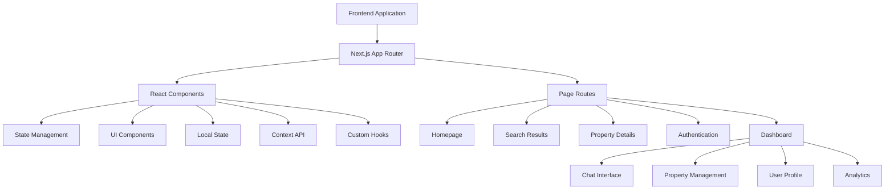
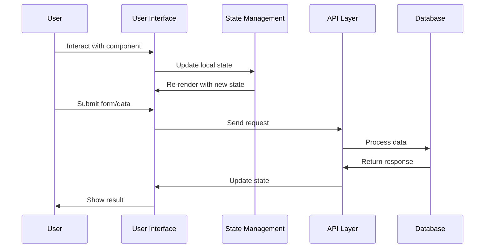
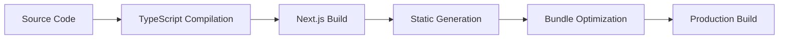

# Dropiti Platform - Technical Specification (v2)

## Table of Contents
- [1. Project Overview](#1-project-overview)
- [2. System Architecture](#2-system-architecture)
- [3. Technology Stack](#3-technology-stack)
- [4. Core Features](#4-core-features)
- [5. Data Models](#5-data-models)
- [6. User Interface Components](#6-user-interface-components)
- [7. Application Structure](#7-application-structure)
- [8. Design System](#8-design-system)
- [9. State Management](#9-state-management)
- [10. Routing & Navigation](#10-routing--navigation)
- [11. Performance Considerations](#11-performance-considerations)
- [12. Development & Deployment](#12-development--deployment)
- [13. Testing Strategy](#13-testing-strategy)
- [14. Future Considerations](#14-future-considerations)

## 1. Project Overview

### 1.1 Project Description
Dropiti Platform is a comprehensive real estate rental platform that connects tenants with landlords. The system provides property listing, search functionality, chat communication, and offer management capabilities. Built with modern web technologies, it offers an intuitive user experience for both tenants and landlords.

### 1.2 Core Objectives
- **Property Management**: Enable landlords to list and manage rental properties
- **Property Discovery**: Provide tenants with powerful search and filtering capabilities
- **Communication**: Facilitate direct communication between tenants and landlords
- **Offer Management**: Streamline the rental offer and negotiation process
- **User Experience**: Deliver a modern, responsive interface across all devices
- **Scalability**: Build a platform that can grow with user demand

### 1.3 Key Features
- Multi-step property creation flow for landlords
- Advanced property search with filters
- Real-time chat system between users
- Property detail pages with comprehensive information
- Offer creation and management system
- Responsive dashboard for both user types
- Modern, accessible user interface

## 2. System Architecture

### 2.1 High-Level Architecture



### 2.2 Component Architecture

```
src/
├── app/                    # Next.js App Router
│   ├── page.tsx          # Homepage
│   ├── search/           # Search functionality
│   ├── property/         # Property details
│   ├── auth/            # Authentication pages
│   ├── dashboard/       # User dashboard
│   └── globals.css      # Global styles
├── components/           # Reusable components
│   ├── common/          # Shared components
│   ├── dashboard/       # Dashboard-specific components
│   ├── auth/           # Authentication components
│   ├── chat/           # Chat system components
│   ├── add-property/   # Property creation flow
│   ├── ui/             # Base UI components
│   └── form/           # Form components
├── types/               # TypeScript type definitions
├── hooks/               # Custom React hooks
├── lib/                 # Utility functions
└── context/             # React context providers
```

### 2.3 Data Flow Architecture



## 3. Technology Stack

### 3.1 Frontend Technologies
| Technology | Version | Purpose |
|------------|---------|---------|
| **Next.js** | 15.2.3 | React framework with App Router |
| **React** | 19.0.0 | Component-based UI library |
| **TypeScript** | 5.x | Type-safe JavaScript development |
| **Tailwind CSS** | 3.4.0 | Utility-first CSS framework |
| **Heroicons** | 2.0.18 | SVG icon library |
| **React Hook Form** | 7.x | Form state management |

### 3.2 UI Libraries & Components
| Library | Purpose |
|---------|---------|
| **@tailwindcss/forms** | Enhanced form styling |
| **Swiper** | Touch slider component |
| **React Dropzone** | File upload handling |
| **React DnD** | Drag and drop functionality |
| **ApexCharts** | Data visualization |
| **FullCalendar** | Calendar component |

### 3.3 Development Tools
| Tool | Purpose |
|------|---------|
| **ESLint** | Code linting and style enforcement |
| **Prettier** | Code formatting |
| **TypeScript Compiler** | Type checking and compilation |
| **PostCSS** | CSS processing |
| **Autoprefixer** | CSS vendor prefixing |

## 4. Core Features

### 4.1 Property Management System

#### 4.1.1 Property Creation Flow
The platform features an 8-step property creation process:

1. **Property Type Selection**: Residential vs Commercial options
2. **Rental Space Type**: Entire, Partial, Shared, or Private
3. **Address Information**: Comprehensive location details
4. **Unit Details**: Area, bedrooms, bathrooms, furnishing status
5. **Amenities Selection**: Visual icon-based selection
6. **Photo Upload**: Drag-and-drop image management
7. **Rental Details**: Pricing, description, availability
8. **Summary Review**: Complete overview before submission

#### 4.1.2 Property Search & Discovery
- **Advanced Filtering**: Location, price range, bedrooms, bathrooms
- **Search Results**: Grid layout with property cards
- **Property Details**: Comprehensive information pages
- **Responsive Design**: Mobile-optimized search experience

### 4.2 Communication System

#### 4.2.1 Real-time Chat
- **Contact Management**: User contact lists
- **Message Threads**: Organized conversation history
- **Real-time Updates**: Live message delivery
- **File Sharing**: Support for media attachments
- **Mobile Responsive**: Optimized for all devices

#### 4.2.2 Offer Management
- **Offer Creation**: Structured offer submission
- **Payment Options**: Full payment or installment plans
- **Lease Terms**: Duration and move-in date selection
- **Validation**: Client-side form validation
- **Summary Preview**: Real-time offer summary

### 4.3 User Dashboard

#### 4.3.1 Tenant Dashboard
- **Saved Properties**: Bookmark favorite listings
- **Recent Activity**: Track interactions and searches
- **Chat History**: Access to all conversations
- **Offer Management**: Track submitted offers

#### 4.3.2 Landlord Dashboard
- **Property Management**: List and edit properties
- **Applications**: Review tenant applications
- **Analytics**: Property performance metrics
- **Communication**: Manage tenant inquiries

## 5. Data Models

### 5.1 Core Entities

#### 5.1.1 Property Entity
```typescript
interface Property {
  id: string;
  title: string;
  description: string;
  location: string;
  bedrooms: number;
  bathrooms: number;
  price: number;
  imageUrl: string;
  available: boolean;
  landlordId: string;
  createdAt: Date;
  updatedAt: Date;
}
```

#### 5.1.2 User Entity
```typescript
interface User {
  id: string;
  email: string;
  name: string;
  role: 'tenant' | 'landlord';
  createdAt: Date;
  updatedAt: Date;
}
```

#### 5.1.3 Property Creation Data
```typescript
interface PropertyData {
  propertyType: 'residential' | 'commercial';
  rentalSpace: 'entire' | 'partial' | 'shared' | 'private';
  address: {
    unit: string;
    floor: string;
    block: string;
    buildingName: string;
    addressLine1: string;
    addressLine2: string;
    district: string;
    state: string;
    country: string;
  };
  unitDetails: {
    grossArea: number;
    netArea: number;
    bedrooms: number;
    bathrooms: number;
    furnished: 'fully' | 'partially' | 'non-furnished';
    petsAllowed: boolean;
  };
  amenities: string[];
  photos: File[];
  rentalDetails: {
    listingName: string;
    listingDescription: string;
    rentalPrice: number;
    availableDate: Date | string | null;
  };
}
```

#### 5.1.4 Offer Data
```typescript
interface OfferData {
  rentalPrice: number;
  leaseDuration: number;
  paymentFrequency: 'full' | 'monthly';
  paymentInterval?: number;
  moveInDate: string;
}
```

### 5.2 Search & Filter Models

#### 5.2.1 Search Filters
```typescript
interface SearchFilters {
  location?: string;
  bedrooms?: number;
  maxPrice?: number;
  minPrice?: number;
}
```

#### 5.2.2 Search Results
```typescript
interface SearchData {
  properties: Property[];
  totalCount: number;
  currentPage: number;
  totalPages: number;
}
```

## 6. User Interface Components

### 6.1 Component Hierarchy

```
App Layout
├── Navigation
├── Main Content
│   ├── Homepage
│   ├── Search Results
│   ├── Property Details
│   └── Dashboard
└── Footer

Dashboard Layout
├── Sidebar Navigation
├── Top Bar
└── Content Area
    ├── Chat View
    ├── Add Property View
    ├── Properties List
    └── Other Dashboard Pages
```

### 6.2 Key Component Specifications

#### 6.2.1 PropertyCard Component
- **Purpose**: Display property information in search results
- **Features**:
  - Property image display
  - Key details (price, location, bedrooms)
  - Action buttons (View Details, Save)
  - Responsive design for all screen sizes

#### 6.2.2 CreateOfferModal Component
- **Purpose**: Submit rental offers to landlords
- **Features**:
  - Form validation
  - Dynamic payment options
  - Real-time offer summary
  - Responsive modal design

#### 6.2.3 ChatView Component
- **Purpose**: Real-time communication interface
- **Features**:
  - Contact list management
  - Message threading
  - File upload support
  - Mobile-responsive design

#### 6.2.4 AddPropertyView Component
- **Purpose**: Multi-step property creation
- **Features**:
  - Step-by-step navigation
  - Form validation
  - Progress tracking
  - Data persistence between steps

### 6.3 UI/UX Design Patterns

#### 6.3.1 Form Design
- **Multi-step flows**: Logical grouping of related fields
- **Real-time validation**: Immediate feedback on user input
- **Error handling**: Clear, actionable error messages
- **Loading states**: Visual feedback during operations
- **Success feedback**: Confirmation of completed actions

#### 6.3.2 Data Display
- **Card layouts**: Consistent information presentation
- **Grid systems**: Responsive layouts for different screen sizes
- **Status indicators**: Visual feedback for system states
- **Interactive elements**: Hover effects and transitions

## 7. Application Structure

### 7.1 Page Organization

#### 7.1.1 Public Pages
- **Homepage** (`/`): Landing page with property showcase
- **Search Results** (`/search`): Property search and filtering
- **Property Details** (`/property/[id]`): Individual property information
- **Authentication** (`/auth/signin`): User login and registration

#### 7.1.2 Dashboard Pages
- **Main Dashboard** (`/dashboard`): User overview and navigation
- **Chat** (`/dashboard/chat`): Communication interface
- **Add Property** (`/dashboard/add-property`): Property creation flow
- **Properties** (`/dashboard/properties`): Property management
- **Applications** (`/dashboard/applications`): Rental applications
- **Analytics** (`/dashboard/analytics`): Performance metrics
- **Saved Properties** (`/dashboard/saved-properties`): Bookmarked listings
- **Activity** (`/dashboard/activity`): Recent user activity

### 7.2 Component Organization

#### 7.2.1 Common Components
- **Footer**: Site-wide footer with company information
- **Navigation**: Main site navigation
- **Modal**: Reusable modal component
- **Button**: Standardized button components

#### 7.2.2 Dashboard Components
- **DashboardLayout**: Shared dashboard structure
- **ChatView**: Chat interface implementation
- **AddPropertyView**: Property creation workflow
- **TenantView/LandlordView**: Role-specific dashboard content

#### 7.2.3 Form Components
- **InputField**: Standardized input component
- **Step Components**: Individual steps of property creation
- **Validation**: Form validation utilities

## 8. Design System

### 8.1 CSS Architecture

#### 8.1.1 Tailwind CSS Foundation
- **Utility-first approach**: Rapid development with pre-built classes
- **Responsive design**: Mobile-first responsive utilities
- **Custom components**: Extended with component classes
- **Design tokens**: Consistent spacing, colors, and typography

#### 8.1.2 Component Classes
```css
/* Form Design System */
.form-input { /* Base input styling */ }
.form-input-sm { /* Small input variant */ }
.form-input-lg { /* Large input variant */ }
.form-button { /* Primary button styling */ }
.form-button-secondary { /* Secondary button styling */ }
.form-label { /* Form label styling */ }
.form-select { /* Select dropdown styling */ }
.form-textarea { /* Textarea styling */ }

/* Dashboard Design System */
.dashboard-container { /* Main dashboard wrapper */ }
.dashboard-sidebar { /* Sidebar navigation */ }
.dashboard-main { /* Main content area */ }
.dashboard-topbar { /* Top navigation bar */ }
```

#### 8.1.3 Authentication Design System
```css
/* Auth-specific styling */
.auth-container { /* Authentication page layout */ }
.auth-form { /* Form styling for auth pages */ }
.auth-button { /* Button styling for auth */ }
.auth-input { /* Input styling for auth */ }
```

### 8.2 Typography & Spacing

#### 8.2.1 Font System
- **Primary Font**: Inter (system font fallback)
- **Font Weights**: 400 (normal), 600 (semibold), 700 (bold)
- **Line Heights**: 1.25 for headings, 1.6 for body text

#### 8.2.2 Spacing Scale
- **Base Unit**: 4px (0.25rem)
- **Common Spacing**: 4, 8, 12, 16, 20, 24, 32, 48, 64px
- **Responsive Scaling**: Mobile-first approach with breakpoint-specific values

### 8.3 Color System

#### 8.3.1 Primary Colors
- **Background**: White (#ffffff) / Dark (#0a0a0a)
- **Foreground**: Dark (#171717) / Light (#ededed)
- **Primary**: Blue (#3b82f6)
- **Secondary**: Gray (#6b7280)

#### 8.3.2 Semantic Colors
- **Success**: Green (#10b981)
- **Warning**: Yellow (#f59e0b)
- **Error**: Red (#ef4444)
- **Info**: Blue (#3b82f6)

## 9. State Management

### 9.1 React State Patterns

#### 9.1.1 Local Component State
```typescript
// Form state management
const [formData, setFormData] = useState<FormData>(initialData);
const [errors, setErrors] = useState<ValidationErrors>({});
const [isLoading, setIsLoading] = useState(false);

// UI state management
const [isOpen, setIsOpen] = useState(false);
const [currentStep, setCurrentStep] = useState(1);
const [sidebarOpen, setSidebarOpen] = useState(false);
```

#### 9.1.2 Form State Management
- **Controlled inputs**: React state for form field values
- **Validation state**: Error tracking and display
- **Submission state**: Loading and success states
- **Multi-step navigation**: Step progression and data persistence

### 9.2 Context & Global State

#### 9.2.1 User Context
```typescript
interface UserContextType {
  user: User | null;
  isAuthenticated: boolean;
  login: (credentials: LoginCredentials) => Promise<void>;
  logout: () => void;
}
```

#### 9.2.2 Application Context
- **Theme management**: Light/dark mode preferences
- **Navigation state**: Current page and navigation history
- **Global loading states**: Application-wide loading indicators

### 9.3 Custom Hooks

#### 9.3.1 Data Fetching Hooks
```typescript
// Property data fetching
const useProperty = (id: string) => {
  const [property, setProperty] = useState<Property | null>(null);
  const [loading, setLoading] = useState(true);
  // Implementation details
};

// Search functionality
const usePropertySearch = (filters: SearchFilters) => {
  const [results, setResults] = useState<SearchData | null>(null);
  const [loading, setLoading] = useState(false);
  // Implementation details
};
```

#### 9.3.2 UI State Hooks
```typescript
// Modal management
const useModal = () => {
  const [isOpen, setIsOpen] = useState(false);
  const open = () => setIsOpen(true);
  const close = () => setIsOpen(false);
  return { isOpen, open, close };
};

// Form validation
const useFormValidation = (schema: ValidationSchema) => {
  const [errors, setErrors] = useState({});
  const validate = (data: any) => { /* validation logic */ };
  return { errors, validate, clearErrors };
};
```

## 10. Routing & Navigation

### 10.1 Next.js App Router

#### 10.1.1 File-based Routing
```
app/
├── page.tsx              # Homepage (/)
├── search/
│   └── page.tsx         # Search page (/search)
├── property/
│   └── [id]/
│       └── page.tsx     # Property details (/property/[id])
├── auth/
│   └── signin/
│       └── page.tsx     # Sign in (/auth/signin)
└── dashboard/
    ├── layout.tsx       # Dashboard layout wrapper
    ├── page.tsx         # Dashboard home (/dashboard)
    ├── chat/
    │   └── page.tsx     # Chat page (/dashboard/chat)
    └── add-property/
        └── page.tsx     # Add property (/dashboard/add-property)
```

#### 10.1.2 Dynamic Routes
- **Property Details**: `/property/[id]` with dynamic property ID
- **User Profiles**: `/user/[id]` for user-specific pages
- **Search Results**: `/search?query=...` with query parameters

### 10.2 Navigation Patterns

#### 10.2.1 Client-side Navigation
```typescript
import { useRouter } from 'next/navigation';

const router = useRouter();

// Programmatic navigation
const handleNavigation = () => {
  router.push('/dashboard');
  router.back();
  router.forward();
};
```

#### 10.2.2 Link Components
```typescript
import Link from 'next/link';

// Navigation links
<Link href="/dashboard" className="nav-link">
  Dashboard
</Link>

// Active link highlighting
const pathname = usePathname();
const isActive = pathname === '/dashboard';
```

### 10.3 Layout Management

#### 10.3.1 Root Layout
- **Global styles**: CSS imports and font loading
- **Metadata**: SEO and page information
- **Providers**: Context providers and global state

#### 10.3.2 Dashboard Layout
- **Sidebar navigation**: Persistent navigation menu
- **Top bar**: User information and quick actions
- **Content area**: Dynamic page content rendering
- **Mobile responsiveness**: Collapsible sidebar for mobile

## 11. Performance Considerations

### 11.1 Frontend Optimization

#### 11.1.1 Code Splitting
- **Route-based splitting**: Separate bundles for each page
- **Component lazy loading**: Load components on demand
- **Dynamic imports**: Conditional component loading

```typescript
// Lazy loading example
const ChatView = dynamic(() => import('@/components/dashboard/ChatView'), {
  loading: () => <div>Loading...</div>,
  ssr: false
});
```

#### 11.1.2 Image Optimization
- **Next.js Image component**: Automatic optimization
- **Responsive images**: Different sizes for different devices
- **Lazy loading**: Images load as they enter viewport
- **Format optimization**: WebP and AVIF support

#### 11.1.3 Bundle Optimization
- **Tree shaking**: Remove unused code
- **Minification**: Compressed production bundles
- **Gzip compression**: Reduced transfer sizes
- **CDN delivery**: Global content distribution

### 11.2 State Management Optimization

#### 11.2.1 Efficient Re-renders
- **Memoization**: Prevent unnecessary component updates
- **Callback optimization**: Stable function references
- **State batching**: Group multiple state updates

```typescript
// Memoized component
const PropertyCard = memo(({ property }: PropertyCardProps) => {
  // Component implementation
});

// Stable callbacks
const handleClick = useCallback(() => {
  // Click handler logic
}, [dependencies]);
```

#### 11.2.2 Data Fetching
- **Request deduplication**: Avoid duplicate API calls
- **Caching strategies**: Store frequently accessed data
- **Pagination**: Handle large datasets efficiently
- **Debounced search**: Optimize search input performance

### 11.3 Mobile Performance

#### 11.3.1 Touch Optimization
- **Touch-friendly targets**: Minimum 44px touch areas
- **Gesture support**: Swipe and pinch gestures
- **Responsive images**: Optimized for mobile bandwidth
- **Progressive loading**: Load content progressively

#### 11.3.2 Mobile-specific Optimizations
- **Viewport optimization**: Proper mobile viewport settings
- **Touch feedback**: Visual feedback for touch interactions
- **Mobile navigation**: Collapsible and touch-friendly navigation
- **Performance monitoring**: Mobile-specific performance metrics

## 12. Development & Deployment

### 12.1 Development Environment

#### 12.1.1 Local Development
```bash
# Development server
npm run dev

# Build application
npm run build

# Start production server
npm start

# Lint code
npm run lint
```

#### 12.1.2 Development Tools
- **Hot reloading**: Instant feedback on code changes
- **TypeScript checking**: Real-time type validation
- **ESLint integration**: Code quality enforcement
- **Prettier formatting**: Consistent code style

### 12.2 Build & Deployment

#### 12.2.1 Build Process


#### 12.2.2 Deployment Options
- **Vercel**: Optimized Next.js deployment
- **Netlify**: Static site hosting
- **AWS Amplify**: Full-stack deployment
- **Self-hosted**: Custom server deployment

### 12.3 Environment Configuration

#### 12.3.1 Environment Variables
```bash
# Development
NEXT_PUBLIC_API_URL=http://localhost:3000/api
NEXT_PUBLIC_ENVIRONMENT=development

# Production
NEXT_PUBLIC_API_URL=https://api.dropiti.com
NEXT_PUBLIC_ENVIRONMENT=production
```

#### 12.3.2 Configuration Management
- **Environment-specific configs**: Different settings per environment
- **Feature flags**: Enable/disable features per environment
- **API endpoints**: Environment-specific API URLs
- **Analytics**: Environment-specific tracking

## 13. Testing Strategy

### 13.1 Testing Pyramid

#### 13.1.1 Unit Tests
- **Component testing**: Individual component functionality
- **Utility testing**: Helper function validation
- **Hook testing**: Custom React hooks
- **Type testing**: TypeScript type validation

#### 13.1.2 Integration Tests
- **Page testing**: Complete page functionality
- **API integration**: Backend service integration
- **User flows**: Multi-step user journeys
- **Cross-component**: Component interaction testing

#### 13.1.3 End-to-End Tests
- **User journeys**: Complete user workflows
- **Cross-browser**: Multiple browser compatibility
- **Mobile testing**: Mobile device functionality
- **Performance testing**: Load and stress testing

### 13.2 Test Implementation

#### 13.2.1 Testing Tools
```typescript
// Jest configuration
module.exports = {
  testEnvironment: 'jsdom',
  setupFilesAfterEnv: ['<rootDir>/jest.setup.js'],
  moduleNameMapping: {
    '^@/(.*)$': '<rootDir>/src/$1',
  },
};

// Component testing example
describe('PropertyCard', () => {
  it('renders property information correctly', () => {
    const property = mockProperty;
    render(<PropertyCard property={property} />);
    
    expect(screen.getByText(property.title)).toBeInTheDocument();
    expect(screen.getByText(`$${property.price}`)).toBeInTheDocument();
  });
});
```

#### 13.2.2 Test Coverage
- **Component coverage**: All React components tested
- **Function coverage**: Utility functions validated
- **Integration coverage**: API and service integration
- **User flow coverage**: Critical user journeys tested

## 14. Future Considerations

### 14.1 Platform Enhancements

#### 14.1.1 Advanced Features
- **Payment integration**: Stripe or similar payment processing
- **Document management**: Contract and agreement storage
- **Notification system**: Email and push notifications
- **Analytics dashboard**: Advanced user and property analytics

#### 14.1.2 Mobile Applications
- **Native iOS app**: Swift-based mobile application
- **Native Android app**: Kotlin-based mobile application
- **React Native**: Cross-platform mobile development
- **Progressive Web App**: Enhanced mobile web experience

### 14.2 Scalability Improvements

#### 14.2.1 Backend Architecture
- **Microservices**: Service-oriented architecture
- **API Gateway**: Centralized request routing
- **Event-driven**: Asynchronous processing
- **Horizontal scaling**: Multi-instance deployment

#### 14.2.2 Database Optimization
- **Read replicas**: Separate read/write operations
- **Caching layer**: Redis for frequently accessed data
- **Data partitioning**: Shard large datasets
- **Search optimization**: Elasticsearch integration

### 14.3 Integration Opportunities

#### 14.3.1 Third-party Services
- **Property management systems**: Direct data synchronization
- **Communication platforms**: Slack, Teams integration
- **Analytics services**: Google Analytics, Mixpanel
- **Marketing tools**: Email marketing, CRM integration

#### 14.3.2 API Development
- **Public API**: Third-party developer access
- **Webhook system**: Real-time event notifications
- **GraphQL API**: Flexible data querying
- **Partner integrations**: Strategic partnership APIs

---

**Document Version**: 2.0  
**Last Updated**: December 2024  
**Authors**: Development Team  
**Review Status**: Updated for Current Codebase 